# Spring Boot URL Shortener

A production-ready URL shortening service built with Spring Boot, featuring user authentication, analytics, caching, and a modern web interface.

## Overview

This project demonstrates enterprise-level system design patterns and best practices for building scalable web applications. It provides a complete URL shortening solution with user management, security, and performance optimization through caching mechanisms.

## Architecture Diagram

```mermaid
graph TB
    Client["🌐 Client Browser"]

    subgraph SpringBoot["Spring Boot Application"]
        Controller["Controller Layer<br/>(Thymeleaf/REST)"]
        Security["Spring Security<br/>(Authentication & AuthZ)"]
        Service["Service Layer<br/>(Business Logic)"]
        Mapper["Entity Mapper<br/>(DTO Conversion)"]
        Repository["Repository Layer<br/>(JPA)"]
    end

    subgraph Cache["Cache Layer"]
        Redis["Redis<br/>In-Memory Store<br/>TTL: 10 min"]
    end

    subgraph Database["Database Layer"]
        Postgres["PostgreSQL<br/>Persistent Storage"]
    end

    Client -->|HTTP Request| Controller
    Controller -->|Authenticate| Security
    Security -->|Authorized| Service
    Service -->|Check Cache| Redis
    Redis -->|Cache Hit ✓| Mapper
    Redis -->|Cache Miss ✗| Repository
    Repository -->|Query| Postgres
    Repository -->|Save to Cache| Redis
    Mapper -->|Response| Controller
    Controller -->|HTTP Response| Client

    style Client fill:#4A90E2,stroke:#2E5C8A,color:#fff
    style SpringBoot fill:#F0F0F0,stroke:#333,color:#333
    style Cache fill:#FF6B6B,stroke:#8B0000,color:#fff
    style Database fill:#4ECDC4,stroke:#0A7377,color:#fff
```



### Data Flow Explanation

1. **Request Phase**: Client sends HTTP request to Spring Boot application
2. **Authentication**: Spring Security validates user credentials and permissions
3. **Cache Check**: Service layer first checks Redis for cached data
   - **Cache Hit**: Return data immediately (fast ⚡)
   - **Cache Miss**: Query database and populate cache
4. **Database Query**: JPA Repository executes optimized SQL queries
5. **Cache Population**: Data is stored in Redis with 10-minute TTL
6. **Response**: DTO Mapper converts entities to safe response objects
7. **Return**: HTTP response sent back to client

## Architecture Patterns

1. **MVC Pattern** - Separation of concerns between Controllers, Services, and Data Access layers
2. **Repository Pattern** - Data abstraction layer using Spring Data JPA for database operations
3. **Service Layer Pattern** - Business logic encapsulation with transaction management
4. **Security Pattern** - Role-based access control with Spring Security (User/Admin roles)
5. **DTO Pattern** - Data Transfer Objects for API boundaries and view models
6. **Entity Pattern** - JPA entities with proper relationship mapping
7. **Cache-Aside Pattern** - Redis caching for frequently accessed URLs (reducing DB queries)
8. **Mapper Pattern** - Entity-to-DTO conversion for clean API contracts
9. **Validation Pattern** - Input validation using Spring Validation annotations
10. **Factory Pattern** - RandomUtils for secure short code generation

## Technologies

### Backend Framework
- **Spring Boot 3.5.6** - Rapid application development framework
- **Java 21** - Latest LTS version with modern language features
- **Spring Data JPA** - ORM abstraction for database operations
- **Spring Security** - Authentication and authorization framework
- **Spring Validation** - Bean validation with JSR-380 support

### Frontend
- **Thymeleaf** - Server-side template engine for HTML rendering
- **Bootstrap 5** - Responsive CSS framework for modern UI
- **WebJars** - Frontend dependency management via Maven

### Database & Caching
- **PostgreSQL** - Primary relational database
- **Redis** - In-memory cache for performance optimization
- **H2** - Embedded database for testing
- **Flyway** - Database migration and versioning tool
- **HikariCP** - Connection pooling for database optimization

### Infrastructure & Tools
- **Docker Compose** - Container orchestration for local development
- **Maven** - Build and dependency management
- **JUnit 5** - Testing framework with Spring Boot Test integration

## Features

- ✅ User registration and authentication
- ✅ URL shortening with custom codes
- ✅ Admin dashboard for user management
- ✅ User dashboard with URL analytics
- ✅ Role-based access control (User/Admin)
- ✅ Redis caching for performance
- ✅ Database migrations with Flyway
- ✅ Input validation and security

## Quick Start

### Prerequisites
- Java 21
- Docker & Docker Compose
- Maven 3.8+

### Setup

```bash
# Clone repository
git clone <repository-url>
cd spring-boot-url-shortener

# Start infrastructure (PostgreSQL + Redis)
docker-compose up -d

# Build application
mvn clean package

# Run application
mvn spring-boot:run
```

Application runs on `http://localhost:8080`

## Configuration

### application.properties
```properties
# Database
spring.datasource.url=jdbc:postgresql://localhost:5432/url_shortener
spring.datasource.username=postgres
spring.datasource.password=postgres

# Redis Cache
spring.data.redis.host=localhost
spring.data.redis.port=6379
spring.cache.type=redis
spring.cache.redis.time-to-live=600000
```

### Docker Compose
PostgreSQL and Redis are automatically configured via `docker-compose.yml`

## API Endpoints

| Method | Endpoint | Description |
|--------|----------|-------------|
| POST | `/register` | Register new user |
| POST | `/login` | User login |
| POST | `/api/urls` | Create shortened URL |
| GET | `/api/urls/{shortCode}` | Redirect to original URL |
| GET | `/my-urls` | User's URLs dashboard |
| GET | `/admin` | Admin dashboard |

## System Design Considerations

### Performance
- **Caching Strategy**: Redis cache for short URLs with 10-minute TTL
- **Connection Pooling**: HikariCP for optimized database connections
- **Query Optimization**: Indexed queries on frequently accessed columns

### Security
- **Authentication**: Spring Security with user/admin roles
- **Password Security**: Encrypted password storage
- **CSRF Protection**: Built-in Spring Security CSRF tokens
- **SQL Injection Prevention**: Parameterized queries via JPA

### Scalability
- **Stateless Design**: Ready for horizontal scaling
- **Database Abstraction**: JPA allows easy database switching
- **Cache Layer**: Redis enables multi-instance deployment
- **Connection Pooling**: HikariCP manages database connections efficiently

### Future Enhancements
- API rate limiting with Resilience4j
- Asynchronous processing with message queues (RabbitMQ/Kafka)
- QR code generation for shared URLs
- Analytics dashboard with charts
- Prometheus metrics and Grafana monitoring
- Distributed tracing with Spring Cloud Sleuth

## Deployment

### AWS ElastiCache Configuration
```properties
# application-prod.properties
spring.data.redis.host=${REDIS_ENDPOINT}
spring.data.redis.port=${REDIS_PORT}
spring.data.redis.password=${REDIS_PASSWORD}
spring.data.redis.ssl=true
```

Deploy on:
- **AWS EC2** - Application server
- **AWS ElastiCache** - Managed Redis
- **AWS RDS** - Managed PostgreSQL
- **AWS ALB** - Load balancer

## Testing

```bash
# Run all tests
mvn test

# Run with coverage
mvn clean test jacoco:report
```

## Project Structure

```
src/main/java/com/manuonda/urlshortener/
├── config/              # Spring configurations (Security, Redis, etc)
├── controller/          # REST controllers and view controllers
├── service/             # Business logic services
├── repository/          # Data access layer (JPA repositories)
├── domain/
│   ├── entities/        # JPA entities
│   ├── models/          # DTOs and command objects
│   └── exceptions/      # Custom exceptions
└── util/                # Utility classes

src/main/resources/
├── application.properties    # Main configuration
├── db/migration/             # Flyway migration scripts
└── templates/                # Thymeleaf templates
```

## References & Resources

- [Siva's Spring Boot Microservices Course](https://www.youtube.com/watch?v=XEgS8yq-zgw&t=13880s) - Architecture patterns and system design principles
- [Spring Boot Official Documentation](https://spring.io/projects/spring-boot)
- [Spring Data JPA Reference](https://spring.io/projects/spring-data-jpa)
- [Spring Security Documentation](https://spring.io/projects/spring-security)
- [Redis in Spring Boot](https://spring.io/projects/spring-data-redis)
- [Flyway Database Migrations](https://flywaydb.org/)

## License

MIT License - Feel free to use this project for learning and development.

## Author

Created as a system design learning project demonstrating enterprise Spring Boot patterns.
