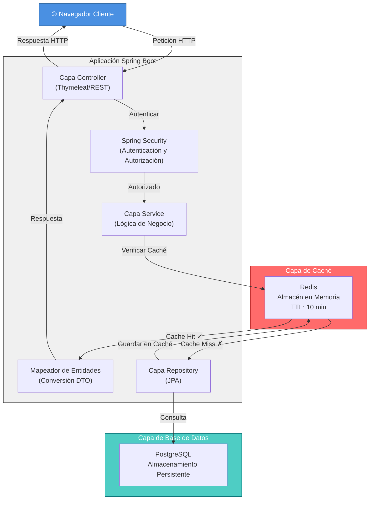

# Acortador de URLs

Un acortador de URLs convierte enlaces largos en versiones cortas y memorables. Cuando alguien visita la URL corta, el sistema redirige automáticamente al destino original, facilitando compartir enlaces en redes sociales y mensajería.

## Resumen

Este proyecto demuestra patrones de diseño de sistemas de nivel empresarial y mejores prácticas para construir aplicaciones web escalables. Proporciona una solución completa de acortamiento de URLs con gestión de usuarios, seguridad y optimización de rendimiento a través de mecanismos de caché.

## Diagrama de Arquitectura



### Explicación del Flujo de Datos

1. **Fase de Petición**: El cliente envía una petición HTTP a la aplicación Spring Boot
2. **Autenticación**: Spring Security valida las credenciales y permisos del usuario
3. **Verificación de Caché**: La capa de servicio primero verifica Redis para datos en caché
   - **Cache Hit**: Retorna datos inmediatamente (rápido ⚡)
   - **Cache Miss**: Consulta la base de datos y llena el caché
4. **Consulta a Base de Datos**: JPA Repository ejecuta consultas SQL optimizadas
5. **Llenado de Caché**: Los datos se almacenan en Redis con TTL de 10 minutos
6. **Respuesta**: DTO Mapper convierte entidades a objetos de respuesta seguros
7. **Retorno**: Respuesta HTTP enviada de vuelta al cliente

## Patrones de Arquitectura

1. **Patrón MVC** - Separación de responsabilidades entre Controladores, Servicios y capas de Acceso a Datos
2. **Patrón Repository** - Capa de abstracción de datos usando Spring Data JPA para operaciones de base de datos
3. **Patrón Service Layer** - Encapsulación de lógica de negocio con gestión de transacciones
4. **Patrón Security** - Control de acceso basado en roles con Spring Security (roles Usuario/Admin)
5. **Patrón DTO** - Objetos de Transferencia de Datos para límites de API y modelos de vista
6. **Patrón Entity** - Entidades JPA con mapeo adecuado de relaciones
7. **Patrón Cache-Aside** - Caché Redis para URLs frecuentemente accedidas (reduciendo consultas a BD)
8. **Patrón Mapper** - Conversión Entidad-a-DTO para contratos de API limpios
9. **Patrón Validation** - Validación de entrada usando anotaciones de Spring Validation
10. **Patrón Factory** - RandomUtils para generación segura de códigos cortos

## Tecnologías

### Framework Backend
- **Spring Boot 3.5.6** - Framework de desarrollo rápido de aplicaciones
- **Java 21** - Última versión LTS con características modernas del lenguaje
- **Spring Data JPA** - Abstracción ORM para operaciones de base de datos
- **Spring Security** - Framework de autenticación y autorización
- **Spring Validation** - Validación de beans con soporte JSR-380

### Frontend
- **Thymeleaf** - Motor de plantillas del lado del servidor para renderizado HTML
- **Bootstrap 5** - Framework CSS responsivo para UI moderna
- **WebJars** - Gestión de dependencias frontend vía Maven

### Base de Datos y Caché
- **PostgreSQL** - Base de datos relacional principal
- **Redis** - Caché en memoria para optimización de rendimiento
- **H2** - Base de datos embebida para pruebas
- **Flyway** - Herramienta de migración y versionado de base de datos
- **HikariCP** - Pool de conexiones para optimización de base de datos

### Infraestructura y Herramientas
- **Docker Compose** - Orquestación de contenedores para desarrollo local
- **Maven** - Gestión de construcción y dependencias
- **JUnit 5** - Framework de pruebas con integración Spring Boot Test

## Características

- ✅ Registro y autenticación de usuarios
- ✅ Acortamiento de URLs con códigos personalizados
- ✅ Panel de administración para gestión de usuarios
- ✅ Panel de usuario con analíticas de URLs
- ✅ Control de acceso basado en roles (Usuario/Admin)
- ✅ Caché Redis para rendimiento
- ✅ Migraciones de base de datos con Flyway
- ✅ Validación de entrada y seguridad

## Inicio Rápido

### Prerequisitos
- Java 21
- Docker y Docker Compose
- Maven 3.8+

### Configuración

```bash
# Clonar repositorio
git clone <repository-url>
cd spring-boot-url-shortener

# Iniciar infraestructura (PostgreSQL + Redis)
docker-compose up -d

# Construir aplicación
mvn clean package

# Ejecutar aplicación
mvn spring-boot:run
```

La aplicación se ejecuta en `http://localhost:8080`

## Configuración

### application.properties
```properties
# Base de datos
spring.datasource.url=jdbc:postgresql://localhost:5432/url_shortener
spring.datasource.username=postgres
spring.datasource.password=postgres

# Caché Redis
spring.data.redis.host=localhost
spring.data.redis.port=6379
spring.cache.type=redis
spring.cache.redis.time-to-live=600000
```

### Docker Compose
PostgreSQL y Redis se configuran automáticamente via `docker-compose.yml`

## Endpoints de la API

| Método | Endpoint | Descripción |
|--------|----------|-------------|
| POST | `/register` | Registrar nuevo usuario |
| POST | `/login` | Inicio de sesión de usuario |
| POST | `/api/urls` | Crear URL acortada |
| GET | `/api/urls/{shortCode}` | Redirigir a URL original |
| GET | `/my-urls` | Panel de URLs del usuario |
| GET | `/admin` | Panel de administración |

## Consideraciones de Diseño del Sistema

### Rendimiento
- **Estrategia de Caché**: Caché Redis para URLs cortas con TTL de 10 minutos
- **Pool de Conexiones**: HikariCP para conexiones optimizadas de base de datos
- **Optimización de Consultas**: Consultas indexadas en columnas frecuentemente accedidas

### Seguridad
- **Autenticación**: Spring Security con roles usuario/admin
- **Seguridad de Contraseñas**: Almacenamiento encriptado de contraseñas
- **Protección CSRF**: Tokens CSRF integrados en Spring Security
- **Prevención de Inyección SQL**: Consultas parametrizadas via JPA

### Escalabilidad
- **Diseño Sin Estado**: Listo para escalamiento horizontal
- **Abstracción de Base de Datos**: JPA permite cambio fácil de base de datos
- **Capa de Caché**: Redis permite despliegue de múltiples instancias
- **Pool de Conexiones**: HikariCP gestiona conexiones de base de datos eficientemente

### Mejoras Futuras
- Limitación de tasa de API con Resilience4j
- Procesamiento asíncrono con colas de mensajes (RabbitMQ/Kafka)
- Generación de códigos QR para URLs compartidas
- Panel de analíticas con gráficos
- Métricas de Prometheus y monitoreo con Grafana
- Trazado distribuido con Spring Cloud Sleuth

## Despliegue

### Configuración AWS ElastiCache
```properties
# application-prod.properties
spring.data.redis.host=${REDIS_ENDPOINT}
spring.data.redis.port=${REDIS_PORT}
spring.data.redis.password=${REDIS_PASSWORD}
spring.data.redis.ssl=true
```

Desplegar en:
- **AWS EC2** - Servidor de aplicación
- **AWS ElastiCache** - Redis gestionado
- **AWS RDS** - PostgreSQL gestionado
- **AWS ALB** - Balanceador de carga

## Pruebas

```bash
# Ejecutar todas las pruebas
mvn test

# Ejecutar con cobertura
mvn clean test jacoco:report
```

## Estructura del Proyecto

```
src/main/java/com/manuonda/urlshortener/
├── config/              # Configuraciones Spring (Security, Redis, etc)
├── controller/          # Controladores REST y controladores de vista
├── service/             # Servicios de lógica de negocio
├── repository/          # Capa de acceso a datos (repositorios JPA)
├── domain/
│   ├── entities/        # Entidades JPA
│   ├── models/          # DTOs y objetos comando
│   └── exceptions/      # Excepciones personalizadas
└── util/                # Clases utilitarias

src/main/resources/
├── application.properties    # Configuración principal
├── db/migration/             # Scripts de migración Flyway
└── templates/                # Plantillas Thymeleaf
```

## Referencias y Recursos

- [Curso de Microservicios Spring Boot de Siva](https://www.youtube.com/watch?v=XEgS8yq-zgw&t=13880s) - Patrones de arquitectura y principios de diseño de sistemas
- [Documentación Oficial de Spring Boot](https://spring.io/projects/spring-boot)
- [Referencia de Spring Data JPA](https://spring.io/projects/spring-data-jpa)
- [Documentación de Spring Security](https://spring.io/projects/spring-security)
- [Redis en Spring Boot](https://spring.io/projects/spring-data-redis)
- [Migraciones de Base de Datos Flyway](https://flywaydb.org/)

## Licencia

Licencia MIT - Siéntete libre de usar este proyecto para aprendizaje y desarrollo.

## Autor

Creado como un proyecto de aprendizaje de diseño de sistemas que demuestra patrones empresariales de Spring Boot.
